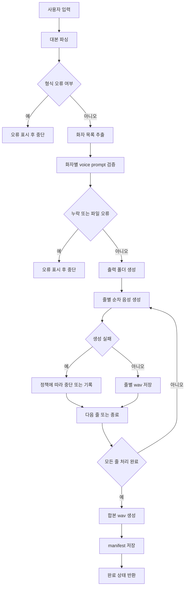

# 다화자 대본 TTS 내부 처리 흐름도

## 1. 전체 흐름 요약

이 기능은 크게 아래 단계로 진행됩니다.

1. 사용자 입력 수집
2. 대본 파싱
3. 화자별 설정 검증
4. 줄별 음성 생성
5. 결과 저장
6. 합본 생성
7. 완료 로그 기록

## 2. 단계별 처리 설명

### 2-1. 사용자 입력 수집

입력값:
- 대본 텍스트
- 화자별 voice prompt 경로
- 화자별 후처리 설정
- 출력 작업 이름
- 줄별 파일 저장 여부
- 합본 저장 여부
- 줄 사이 무음 길이

### 2-2. 대본 파싱

처리 규칙:
- 줄바꿈 기준으로 분리
- 빈 줄 제거
- 각 줄에서 첫 번째 `:` 기준으로 `화자`, `대사` 분리
- 순번 부여

파싱 결과 예시:

```text
[
  {"line_index": 1, "speaker": "나레이터", "text": "오늘은 새로운 기능을 소개합니다."},
  {"line_index": 2, "speaker": "여자1", "text": "첫 번째 장면입니다."}
]
```

### 2-3. 화자별 설정 검증

검증 항목:
- 모든 화자에 voice prompt가 연결되었는가
- 지정 파일이 실제로 존재하는가
- 모델이 로드되었는가
- 대사가 비어 있는 줄은 없는가

### 2-4. 줄별 음성 생성

처리 방식:
- 대본 줄을 순서대로 순차 처리
- 해당 화자의 voice prompt를 불러와 TTS 생성
- 필요 시 후처리 적용
- 줄별 wav 저장

### 2-5. 생성 결과 누적

각 줄 처리 후 아래 정보를 누적 저장합니다.

- line index
- speaker
- text
- output path
- duration
- success/failure
- error message

### 2-6. 전체 합본 생성

조건:
- 사용자가 합본 저장을 켠 경우
- 줄별 생성이 모두 성공했거나 허용된 실패 정책 범위 안인 경우

처리:
- 줄별 wav를 순서대로 읽음
- 각 줄 사이에 무음 추가
- 하나의 final wav로 저장

### 2-7. 메타데이터 저장

작업 폴더에 `script_manifest.json` 저장

포함 정보:
- 원본 대본
- 파싱 결과
- 화자별 설정
- 실행 시각
- 생성된 파일 목록
- 실패 로그

## 3. 텍스트 흐름도

```text
[사용자 입력]
   |
   v
[대본 텍스트 수집]
   |
   v
[줄 단위 파싱]
   |
   +-- 오류 있음 --> [오류 메시지 표시 후 중단]
   |
   v
[화자 목록 추출]
   |
   v
[화자별 voice prompt 매핑]
   |
   +-- 누락 있음 --> [누락 화자 표시 후 중단]
   |
   v
[출력 작업 폴더 생성]
   |
   v
[1번째 줄 생성]
   |
   v
[2번째 줄 생성]
   |
   v
[3번째 줄 생성]
   |
   v
[... 마지막 줄까지 반복]
   |
   +-- 중간 실패 --> [정책에 따라 중단 또는 실패 기록]
   |
   v
[줄별 결과 저장]
   |
   v
[합본 wav 생성]
   |
   v
[manifest 저장]
   |
   v
[완료 상태 반환]
```

## 4. Mermaid 흐름도



## 5. 내부 함수 분리 제안

기능을 나눌 때는 아래 정도의 책임 분리가 적당합니다.

- `parse_script_lines(script_text)`
- `extract_speakers(parsed_lines)`
- `validate_speaker_assignments(parsed_lines, speaker_configs)`
- `create_multi_speaker_job_dir(job_name)`
- `generate_line_audio(line_item, speaker_config)`
- `merge_line_audios(audio_paths, silence_ms, output_path)`
- `save_job_manifest(job_data)`

## 6. 기존 코드와 연결될 가능성이 큰 지점

예상 연결 파일:
- [tts_app.py](/f:/abc/qwen-tts/tts_app.py)
- [tts.py](/f:/abc/qwen-tts/tts.py)

예상 연결 방식:
- `tts_app.py`에서 새 탭과 입력 UI 추가
- `tts.py`에 다화자 생성용 헬퍼 함수 추가
- 기존 `generate_from_prompt_file(...)` 계열 로직을 재사용
